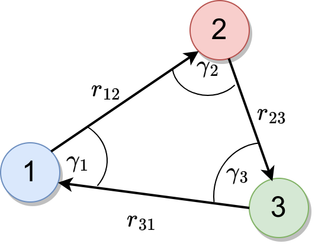

# Axilrod-Teller(-Muto) Potential

[Reference Paper](https://pubs.aip.org/aip/jcp/article/11/6/299/182086/Interaction-of-the-van-der-Waals-Type-Between)

The Axilrod-Teller potential is a model for the interactions of three molecules which appear when the van der Waals forces are approximated to the third order.

$$ U_{AT} = \nu \frac{3 \cos\gamma_1 \cos\gamma_2 \cos\gamma_3 + 1}{r_{12}^3 r_{23}^3 r_{31}^3} $$
, where $r_{ij}$ is the distance between particles $i$ and $j$ and $\gamma_i$ is the angle between the sides $r_{ij}$ and $r_{ik}$. $\nu$ is a material dependent parameter of the order $V\alpha^3$, where $V$ is the ionization energy and $\alpha$ the polarizability.

The cosines can also be expressed as:
$$\cos\gamma_1 = \frac{\vec{r}_{12} \cdot \vec{r}_{13}}{|\vec{r}_{12}||\vec{r}_{13}|}$$
, where $\vec{r}_{ij}$ is the vector from particle $i$ to particle $j$ ($i \longrightarrow j$ ).
It is calculated as $\vec{x}_j - \vec{x}_i$, where $\vec{x}_i$ is the position of particle $i$.

Therefore, the potential can also be expressed as:
$$ U_{AT} = \nu \frac{-3 (\vec{r}_{12}\cdot \vec{r}_{31}) (\vec{r}_{12} \cdot \vec{r}_{23}) (\vec{r}_{31} \cdot \vec{r}_{23}) + r_{12}^2 r_{23}^2 r_{31}^2}{r_{12}^5 r_{23}^5 r_{31}^5} $$
Note that we have $-3$ because we use the circular vectors $\vec{r}_{12}, \vec{r}_{23}, \vec{r}_{31}$.

The derivative can be calculated by applying the chain rule and leads to a resulting Force exerted on particle $1$:
$$ \vec{F}_{1} = - \frac{\partial U_{AT}}{\partial \vec{x}_1}$$

$$
F_1
=\frac{3}{rrr^5}\cdot\left[ \left( -5\frac{<>_1<>_2<>_3}{r_{12}^2} - <>_1<>_3 + r_{23}^2r_{31}^2\right)\cdot \vec{r}_{12} \\
+\left( 5\frac{<>1<>2<>3}{r_{23}^2} + <>_1<>_3 - r_{12}^2r_{31}^2\right)\cdot\vec{r}_{23} \\
+\left( <>_2<>_3 - <>_2<>_1 \right)\cdot \vec{r}_{31} \right]
$$
, where $<>_1=\vec{r}_{12}\cdot\vec{r}_{31}$ and so on. The terms are already ordered to show the contribution from all three distance vectors.

### Newton's third law
To apply Newton's third law the force on particle $2$ needs to be calculated in a similar fashion as for particle $1$. The force on particle $3$ can then be written as the negative sum of the other two forces:
$$\vec{F}_3 = -(\vec{F}_1 + \vec{F}_2)

